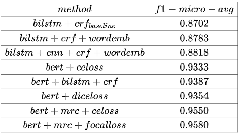

# sequence tagging project

依赖包：主要是tensorflow 1.12.0，其余见requirements.txt

目前项目包含了传统的Bilstm-crf模型和使用了bert的模型。

针对的数据：目前是基于字符级别标注的实体识别数据。使用网上公开的字符级的中文词向量。

TODO：

1、结合词级别的词向量与字符向量结合，做字符级别的tagging,已完成100%

2、joint learning with intent classification

3、不用bert，在lstm-crf基础上进行优化，增加cnn的架构，或者attention机制。已完成100%

4、seq label 转化为阅读理解问题。参考最新的论文 A Unified MRC Framework for Named Entity Recognition 已完成100%

使用的词向量来源于：

https://github.com/Embedding/Chinese-Word-Vectors

词向量模型存放在data/embedding_data路径下

使用的bert预训练模型为：

chinese_roberta_wwm_ext_L-12_H-768_A-12

bert预训练模型存放在data/根路径下

训练数据目前暂时没法传上来，但是格式可以如下所示：

> 海 钓 比 赛 地 点 在 厦 门 与 金 门 之 间 的 海 域 。 
>
> O O O O O O O B-LOC I-LOC O B-LOC I-LOC O O O O O O

如上为一条样本。项目中的data_preprocessing会根据不同的方法做预处理，并将处理后的数据用.npy格式存储。

目前bert+mrc训练和评测没有问题，其他方法待优化完善。

## 训练运行脚本：

```shell
bash run_train.sh
```


## 评测运行脚本：

```shell
bash run_pred.sh
```


## 实验结果部分汇总：



